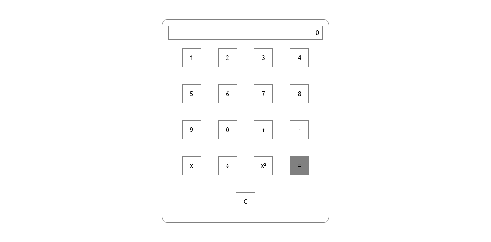

# React-Calculator

## 🔖 Sobre
O React-Calculator foi um desafio desenvolvido no bootcamp fornecido pela [IGTI](https://www.igti.com.br/).

<br/>

## 📷 Interface
<p align="center">
  <br/>
  
</p>

<br/>

## 🚀 Tecnologias utilizadas

- [React](https://reactjs.org/)
- [Materialize](https://materializecss.com/getting-started.html)

<br/>

## 🗂 Como baixar e iniciar o projeto

```bash
# Abra um terminal e copie este repositório com o comando
$ git clone https://github.com/carlos-mattos/react-calculator.git
# ou use a opção de download.

# Entre na pasta react-calculator
$ cd react-salary

# Instale as dependências
$ npm install

# Inicie o React
$ npm start
```
<br/>

Desenvolvido por [Carlos Eduardo](https://www.linkedin.com/in/carlos-eduardo-andrade-de-mattos-a060b1182/) 🤓
